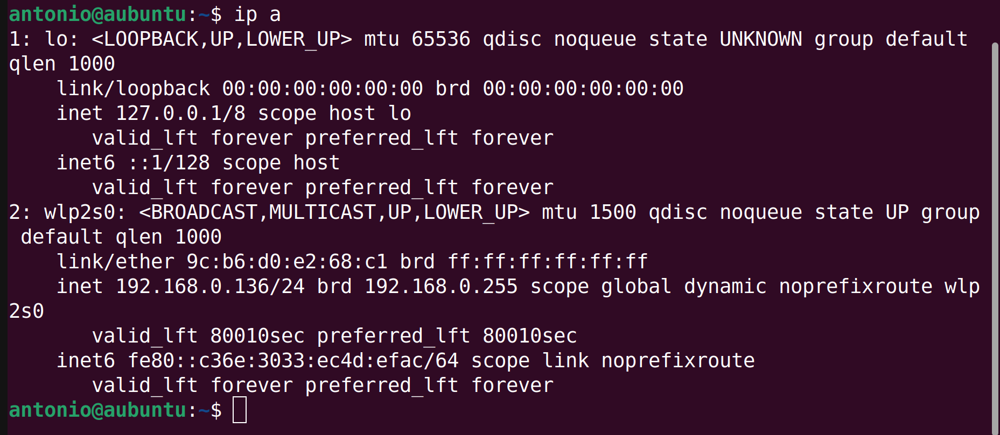
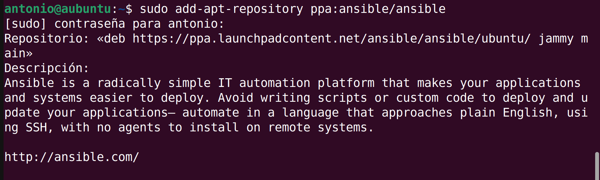
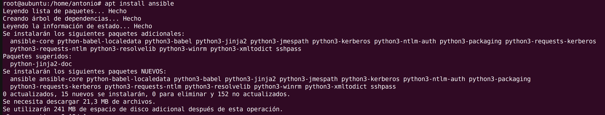

# Instalación de Ansible

Para instalar Ansible, necesitamos lo siguiente:
- Una máquina central(Ubuntu) con IP 192.168.0.136/24.

- Una máquina virtual(Ubuntu) donde desplegar las aplicaciones.

Para empezar, añadimos el repositorio a nuestra máquina principal:

Actualizamos los paquetes:

Instalamos Ansible:

COmprobamos que Ansible ha sido instalado:

