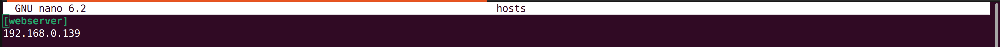
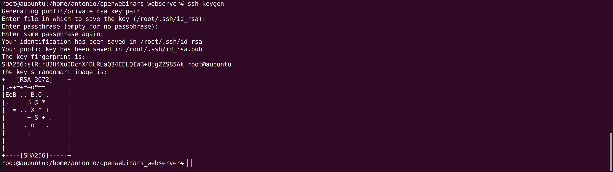
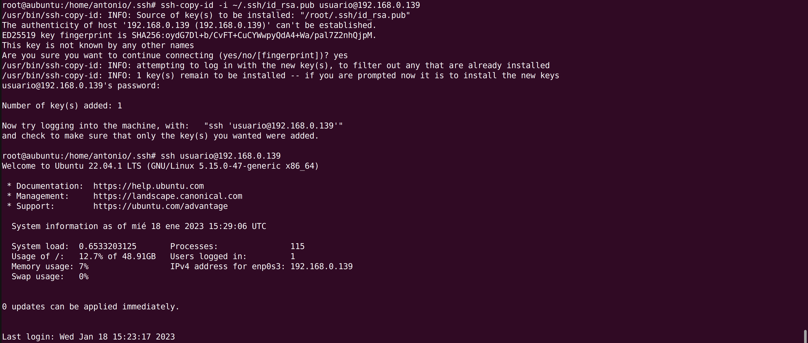
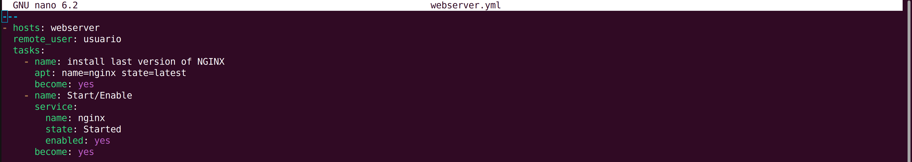

# Configurar un playbook en Ansible
- Los playbooks nos permiten gestionar la configuración del despliegue.
- Describen la serie de pasos o tareas a seguir.

Para empezar, creamos una carpeta que va a hacer de playbook donde almacenaremos todos los fichero.

Creamos un fichero llamado hosts e indicamos el nodo que vamos a realizar en los despliegues. Lo definimos:

Entre corchetes ponemos el grupo que va a identificar la ip.

Creamos una clave ssh para acceder al servidor remoto y copiamos nuestra clave pública al nodo remoto:

Y la pasamos al remoto para poder acceder a él:

Ahora configuramos nuestro primer playbook:

Creamos un fichero llamado webserver.yml y definimos el host remoto donde queremos que despliege,el usuario que queremos que utilice, y las tasks:

- Añadimos el host para el servidor que queremos usar.
- remote para conectarse a la máquina remota.
- Las tasks (que son los modulos que se ejecutan en el playbook) teniendo en cuenta las identaciones:
    - la tarea se llamará install last version of nginx.
    - Queremos la ultima version (apt). 
    - Le damos permiso de sudo (become). 
    - Lo arrancamos (name).
    - Le decimos que queremos arrancar nginx (name, state, enabled).
