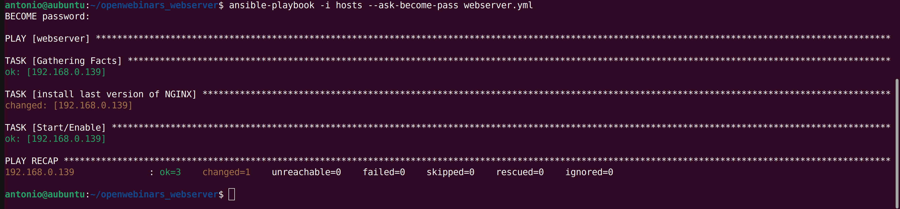
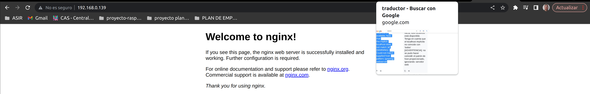

# Desplegar servicios en Ansible
Para desplegar el playbook usamos el siguiente comando:

`ansible-playbook -i hosts --ask-become-pass webserver.yml`

Ahora comprobamos que se ha instalado nginx correctamente desde el navegador:

